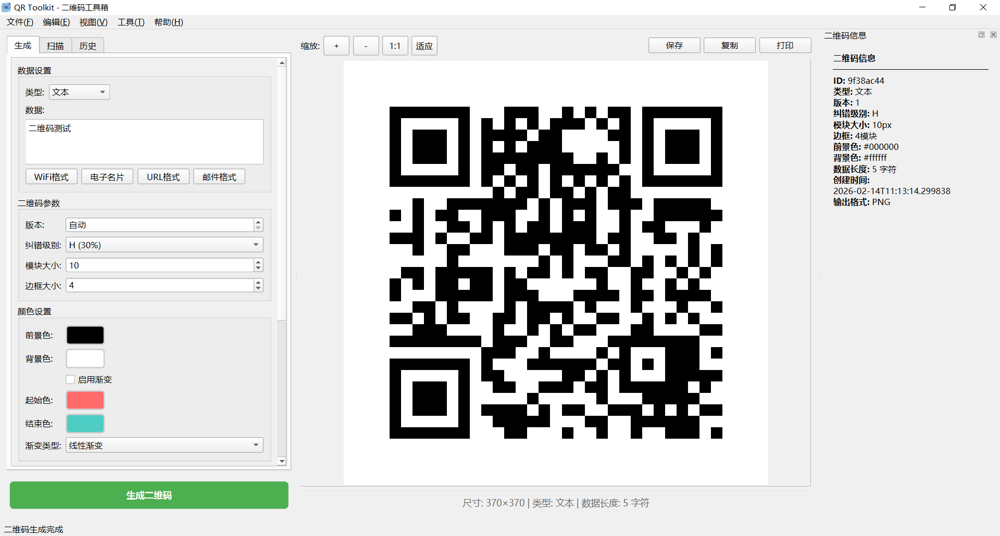
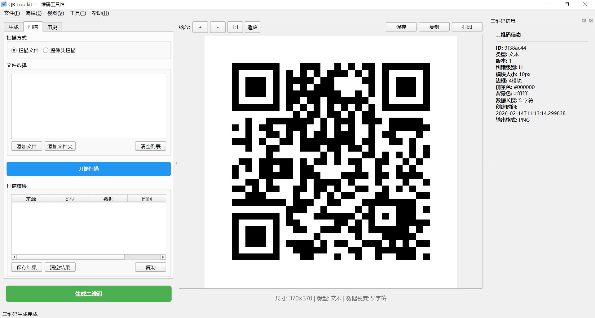
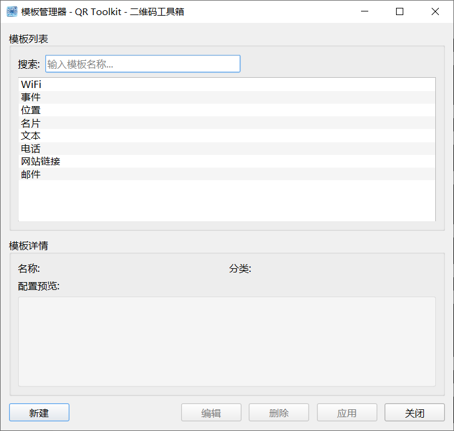

# QR Toolkit - 二维码工具箱

<div align="center">


**一个二维码生成、扫描和管理工具**

[](LICENSE)
[](https://www.python.org/downloads/)
[](https://doc.qt.io/qtforpython/)
[](https://github.com/astral-sh/uv)
[](https://gitee.com/icodewr/qrcode_toolkit)
[](https://github.com/ICodeWR/qrcode_toolkit)

</div>

---

## 📖 项目简介

**QR Toolkit** 是一款开源的、跨平台的二维码工具箱，提供二维码的**生成**、**扫描**、**批量处理**和**模板管理**等功能。无论是个人日常使用，还是企业批量处理，QR Toolkit 都能为您提供帮助，同时该项目还可作为Python编程学习者的开发实战项目。

### 主要特性

- **二维码生成** - 支持文本、URL、WiFi、电子名片、电子邮件、电话、地理位置等十余种类型
- **高级编辑** - 支持自定义颜色、渐变效果、Logo添加及Logo缩放比例调节
- **二维码扫描** - 支持图片文件扫描和摄像头实时扫描，自动识别二维码位置
- **批量处理** - 批量生成二维码、批量扫描图片中的二维码
- **模板管理** - 保存常用配置为模板，快速复用
- **历史记录** - 自动保存生成记录，支持搜索、加载、删除、导出
- **数据库支持** - 使用SQLite存储二维码数据和模板
- **多格式导出** - 支持PNG、JPEG、SVG、PDF、GIF、BMP等多种输出格式
- **跨平台** - 支持Windows、macOS、Linux

---

## 快速开始

### 系统要求

- Python 3.8 或更高版本，推荐 3.13.0
- PySide6 6.10.1 或更高版本
- [uv](https://github.com/astral-sh/uv) 包管理器（推荐）或 pip

### 安装方式

#### 方式一：使用 uv（推荐）

```bash
# 克隆仓库
git clone https://github.com/ICodeWR/qrcode_toolkit.git
或
git clone https://gitee.com/ICodeWR/qrcode_toolkit.git
cd qrcode_toolkit

# 使用 uv 创建虚拟环境并安装依赖
uv venv
uv pip install -e .

# 启动应用
uv run python main.py
```

#### 方式二：使用 pip

```bash
# 克隆仓库
git clone https://github.com/ICodeWR/qrcode_toolkit.git
或
git clone https://gitee.com/ICodeWR/qrcode_toolkit.git
cd qrcode_toolkit

# 创建虚拟环境（可选）
python -m venv venv
# source venv/bin/activate  # Linux/macOS
venv\Scripts\activate  # Windows

# 安装依赖
pip install -e .

# 启动应用
python main.py
```

---

## 界面预览

| 生成界面 | 扫描界面 | 模板管理 |
|---------|---------|---------|
|  |  |  |

---

## 使用指南

### 1. 生成二维码

1. 在"生成"选项卡中输入要编码的数据
2. 选择二维码类型（自动识别或手动选择）
3. 调整二维码参数：
   - **版本**：1-40，0表示自动
   - **纠错级别**：L(7%)、M(15%)、Q(25%)、H(30%)
   - **模块大小**：1-50像素
   - **边框大小**：0-10模块
4. 设置颜色：
   - 前景色、背景色
   - 可选线性/径向渐变
5. 添加Logo（可选）：
   - 选择Logo图片
   - 调节缩放比例（5%-50%，建议15%-30%）
6. 添加标签和备注（可选）
7. 点击"生成二维码"按钮

### 2. 扫描二维码

#### 文件扫描
1. 切换到"扫描"选项卡
2. 选择"扫描文件"
3. 添加图片文件（PNG、JPG、BMP等）
4. 点击"开始扫描"
5. 查看扫描结果，支持保存为CSV/JSON/TXT

#### 摄像头扫描
1. 切换到"扫描"选项卡
2. 选择"摄像头扫描"
3. 选择可用摄像头
4. 点击"开始扫描"
5. 将二维码对准摄像头，自动识别并显示结果

### 3. 批量处理

#### 批量生成
1. 打开"工具 → 批量处理器"
2. 选择"批量生成"选项卡
3. 导入CSV文件或直接输入文本数据（每行一个）
4. 设置输出目录、文件名前缀、输出格式
5. 配置二维码参数（同单次生成）
6. 点击"开始"批量生成

#### 批量扫描
1. 打开"工具 → 批量处理器"
2. 选择"批量扫描"选项卡
3. 选择包含二维码图片的文件夹
4. 设置输出文件路径
5. 点击"开始"批量扫描
6. 自动将结果保存为CSV文件

### 4. 模板管理

1. 打开"工具 → 模板管理器"
2. **新建模板**：配置好二维码参数后，点击"保存为模板"
3. **应用模板**：在模板管理器中选择模板，点击"应用"
4. **编辑模板**：修改已有模板的配置
5. **删除模板**：移除不再需要的模板

### 5. 历史记录

1. 切换到"历史"选项卡
2. 查看所有生成的二维码记录
3. **加载**：双击记录或选择后点击"加载"
4. **删除**：选择记录后点击"删除"
5. **清空**：删除所有历史记录
6. **导出**：将历史记录导出为JSON文件

---

## 技术架构

### 项目结构

```
qrcode_toolkit/
├── core/               # 核心功能模块
│   ├── database.py    # 数据库管理
│   ├── engine.py      # 二维码生成引擎
│   ├── models.py      # 数据模型
│   └── scanner.py     # 二维码扫描器
├── gui/               # 图形界面模块
│   ├── main_window.py # 主窗口
│   ├── batch_processor.py # 批量处理器
│   ├── template_editor.py # 模板编辑器
│   ├── template_manager.py # 模板管理器
│   └── widgets.py     # 自定义组件
├── utils/             # 工具模块
│   └── constants.py   # 常量定义
├── tests/             # 单元测试
│   ├── test_database.py
│   ├── test_engine.py
│   └── ...
├── resources/         # 资源文件
│   ├── icon.png
│   └── splash.png
├── main.py            # 应用入口
├── pyproject.toml     # 项目配置
└── README.md          # 本文档
```

### 核心技术栈

| 组件 | 技术 | 用途 |
|------|------|------|
| GUI框架 | PySide6 (Qt6) | 跨平台图形界面 |
| 二维码生成 | qrcode, segno | 标准二维码、SVG输出 |
| 二维码扫描 | pyzbar, OpenCV | 图片/摄像头二维码识别 |
| 图像处理 | Pillow | Logo合成、图像处理 |
| 数值计算 | NumPy | 图像矩阵运算 |
| 数据库 | SQLite3 | 本地数据存储 |
| 项目管理 | uv | 快速依赖安装 |
| 测试框架 | pytest | 单元测试 |
| 检查工具 | mypy | 静态检查 |

---

## 开发指南

### 环境配置

```bash
# 克隆仓库
git clone https://github.com/ICodeWR/qrcode_toolkit.git
cd qrcode_toolkit

# 安装uv（如果尚未安装）
pip install uv

# 创建虚拟环境并安装开发依赖
uv venv
uv pip install -e ".[dev]"

# 安装pre-commit钩子（可选）
pre-commit install
```

### 运行测试

```bash
# 运行所有测试
uv run pytest

# 运行特定测试文件
uv run pytest tests/test_database.py

# 带覆盖率报告
uv run pytest --cov=core --cov=gui --cov-report=html
```

### 构建打包

```bash
# 构建源码包和wheel包
uv build

# 产物位于 dist/ 目录
```

### 代码规范

- 遵循 [PEP 8](https://www.python.org/dev/peps/pep-0008/) 编码规范
- 使用类型注解增强代码可读性
- 所有公共函数和类必须包含文档字符串
- 提交前确保测试全部通过

---

## 更新日志

### 版本 0.9.0 (2026-2-14)
- **发布**：首个正式版本
- **功能**：二维码生成、扫描、批量处理、模板管理、历史记录
- **界面**：完整的主窗口界面、菜单栏、工具栏、停靠窗口

---

## 贡献指南

欢迎贡献代码、报告问题或提出新功能建议！

1. **Fork** 本仓库
2. 创建您的特性分支 (`git checkout -b feature/AmazingFeature`)
3. 提交您的更改 (`git commit -m 'Add some AmazingFeature'`)
4. 推送到分支 (`git push origin feature/AmazingFeature`)
5. 打开一个 **Pull Request**

### 贡献者公约

请尊重所有贡献者和用户。我们致力于营造一个开放、友好的社区环境。

---

## 📄 许可证

本项目采用 **MIT License** 开源协议。

---

## 📞 联系我们

- **作者**：码上工坊
- **微信公众号**：码上工坊
- **项目主页**：
  - Gitee：[https://gitee.com/icodewr/qrcode_toolkit](https://gitee.com/icodewr/qrcode_toolkit)
  - GitHub：[https://github.com/ICodeWR/qrcode_toolkit](https://github.com/ICodeWR/qrcode_toolkit)
- **问题反馈**：[Issues](https://gitee.com/icodewr/qrcode_toolkit/issues)

---

<div align="center">

**如果这个项目对您有帮助，请给一个 ⭐️ 支持！**

<div align="center">
  </img>
</div>
<strong >码上工坊 © 2026</strong><br>
<em>让代码为你工作，在创造中学习成长 🚀</em>
</div>
</div>